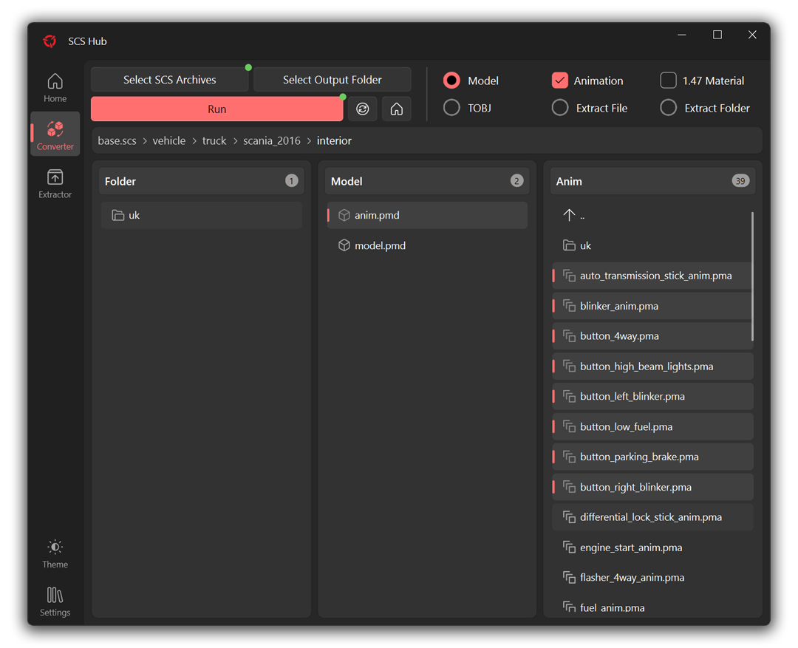

  

  An app to gather most of SCS games modding tools in one place

  
  
  
  

##

  
  

## Feature
- [x] [**Converter PIX**](https://forum.scssoft.com/viewtopic.php?t=216158)
  - [x] Single Model and Single TOBJ mode with conversion 
  - [x] Animation export
  - [x] Past 1.47 material attributes
  - [x] Extract specific File and Folder without conversion
  - [ ] Convert whole archive
- [x] [**SCS Extractor**](https://modding.scssoft.com/wiki/Documentation/Tools/Game_Archive_Extractor)
  - [x] Extract whole archive without conversion
- [ ] [**SXC Extractor**](https://forum.scssoft.com/viewtopic.php?t=276948)
- [ ] [**Batch DDS to TGA**](https://forum.scssoft.com/viewtopic.php?t=190908)

## Known issue
- App
  - Not tested in Linux and Mac
  - `Open log` and `Open Folder` buttons in InfoBar only work in windows
  - `Badge` on button will be miss-aligned after select archive
- Converter PIX
  - Ctrl + A in anim list will select all file and folder (just `Select & drag mouse` or `Single click`)
- SCS Extractor
  - Only work in windows

## Thanks to

> [**zhiyiYo**](https://github.com/zhiyiYo) - [PyQt Fluent Widgets](https://github.com/zhiyiYo/PyQt-Fluent-Widgets) and it's gallery app code

> [**mwl4**](https://github.com/mwl4) - [Converter PIX](https://github.com/mwl4/ConverterPIX) project

> [**simon50keda**](https://github.com/simon50keda) - [Converter PIX Wrapper](https://github.com/simon50keda/ConverterPIXWrapper) for inspiration and code help