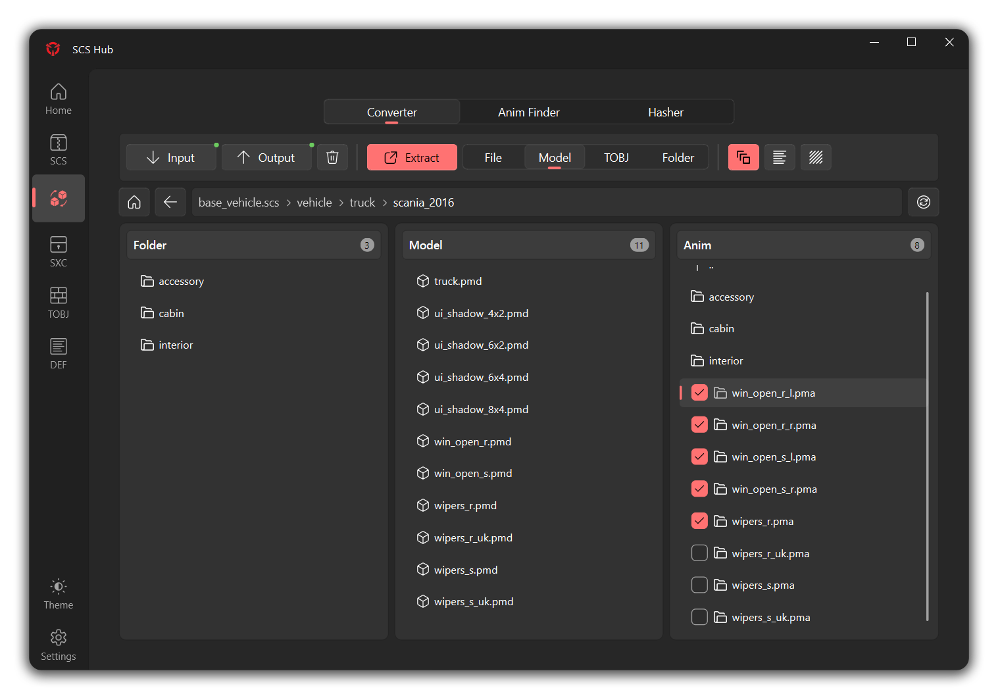

<p align="center">
  
</p>
<p align="center">
  SCS games modding tools in one place
</p>

<p align="center">
  
  
  
</p>

##
<p align="center">
  
  
  
</p>

## Install
- Windows
  - Download `SCSHub_x.x.exe` asset from [**Releases**](https://github.com/AmirMahdaviAM/SCSHub/releases) and run file
  - Or you can procced with below instruction
- Linux, Mac
  - Required `Python 3.10+` (maybe lower, not tested)
  - Clone repo or download repo zip
  ```shell
  git clone https://github.com/AmirMahdaviAM/SCSHub
  ```
  - Install requirements
  ```shell
  pip install -r requirements.txt
  ```
  - Run app
  ```shell
  python SCSHub.py
  ```

## Feature
- [x] [**SCS Extractor**](https://modding.scssoft.com/wiki/Documentation/Tools/Game_Archive_Extractor)
  - [x] Official extractor and packer
  - [x] Implemented feature
- [x] [**Converter PIX**](https://forum.scssoft.com/viewtopic.php?t=216158)
  - [x] Multi base input
  - [x] Single Model and Single TOBJ mode with conversion 
  - [x] Extract specific File or Folder without conversion
  - [x] Animation export
  - [x] Use old dds format
  - [x] Past 1.47 material attributes
  - [x] Animation finder
  - [x] File and string hasher
  - [ ] Convert whole archive
- [x] [**SXC Extractor**](https://forum.scssoft.com/viewtopic.php?t=276948)
  - [x] Single click finder & extractor (SXCFinder + My new path finder)
  - [x] SXC Packer
  - [x] SXC Finder
  - [ ] SXC Extractor
- [x] **TOBJ Editor**
  - [x] Full attributes tobj editor and creator
  - [x] Binary formant (import and export)
  - [x] Text formant (only export)
  - [x] 2D tobj support
  - [ ] Cube tobj support
- [x] **Def creator**
  - [x] Create simple def from pmd/pim accessory folder
  - [x] Custom directory names
  - [x] Custom name and filenames
  - [ ] Create def for hookups
- [ ] **Sii Editor**
- [ ] **Sii Decryptor**
- [ ] **DDS to TGA**
- [ ] **Save Editor**
- [ ] **Font Creator**

## Known issue
- App
  - Not tested in Linux and Mac
  - `Open log` and `Open Folder` buttons in InfoBar only work in windows
- SCS Extractor
  - Only work in windows
- Converter PIX
  - Ctrl + A in anim list will select all file and folder (just `Select & drag mouse` or `Single click`)

## Localization
If you want to help translate app to your language, Please check SCS Hub project in [**Crowdin**](https://crowdin.com/project/scshub)


## Thanks to

> [**zhiyiYo**](https://github.com/zhiyiYo) - [PyQt Fluent Widgets](https://github.com/zhiyiYo/PyQt-Fluent-Widgets) and it's gallery app code

> [**mwl4**](https://github.com/mwl4) - [Converter PIX](https://github.com/mwl4/ConverterPIX) project

> [**simon50keda**](https://github.com/simon50keda) - [Converter PIX Wrapper](https://github.com/simon50keda/ConverterPIXWrapper) for inspiration and code help
